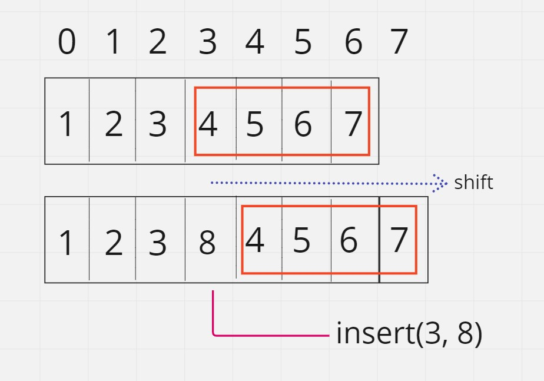

# 01 - Vectors

Why Vectors?

Vector is a dynamic array so it has an array (controlled by its pointer) as a data member. But arrays (built-in ones in C++) has some limitations including:

* Fixed size : once defined it can't be changed
* Limited functionalities : get and set are the only methods supported for arrays. We need more support such as insert, append, remove, filter, etc.

We can overcome these limitations by using vectors.


## 01 - Define a vector class

Our vector class will have 2 data members:

* A pointer (e.g., pointer to an integer) that wil represent our array.
* A size variable that tracks the current size of our array.

```cpp
class Vector
{
private:
	int* arr = nullptr;
	int size = 0;
}
```

It will have a constructor that takes the size as an argument (no default constructors),

```cpp
class Vector
{
private:
	int* arr = nullptr;
	int size = 0;

public:
	Vector(int size) : size(size)
	{
		if (size < 0)
		{
			size = 1;
		}
		arr = new int[size] {};
	}
}
```

this constructor makes sure that the size isn't negative (if it is, it assigns the size to 1). Then creates an array with the size provided and assigns its pointer to its data member `arr`.

It also has a destructor which simply `delete`s `arr` and assigns it to `nullptr` and `size` to 0.

```cpp
class Vector
{
private:
	int* arr = nullptr;
	int size = 0;

public:
	Vector(int size) : size(size)
	{
		if (size < 0)
		{
			size = 1;
		}
		arr = new int[size] {};
	}

	~Vector()
	{
		delete[] arr;
		arr = nullptr;
		size = 0;
	}
};
```

## 02 - Get and Set

The built-in arrays has its own get and set methods by using the `[]` operator. We can make use of it in our own `Vector` get and set methods. We can also add some assertions to check if the index, in which the value is to be got/set, is valid or not.

```cpp
int get(int index)
{
        assert(0 <= index && index < size);
        return arr[index];
}

void set(int index, int val)
{
        assert(0 <= index && index < size);
        arr[index] = val;
}
```

## 03 - Print

For printing, it is quite straight forward. Loop from beginning until `size` of `arr` and print the value at it followed by a space. After the loop, print a newline.

```cpp
void print()
{
        for (int i = 0; i < size; ++i)
        {
                cout << arr[i] << " ";
        }
        
        cout << endl;
}
```

## 04 - Find

To find a given element in the vector, we loop over all elements and we check for each element if it equals the given element. If it does, we return its index. Else, we return -1 which is an invalid index in our get/set functions.


```cpp
int find(int value)
{
        for (int i = 0; i < size; ++i)
        {
                if (arr[i] == value)
                {
                        return i;
                }
        }

        return -1; // if not found
}
```

Now, we can use the previous methods in an example,

```cpp
// main.cpp

#include "Vector.h"

#include <iostream>

int main()
{
	Vector v(10);
	for (int i = 0; i < 10; ++i)
	{
		v.set(i, i);
	}
	v.print();
	cout << v.find(5) << "\t" << v.find(55) << endl;
	return 0;
}
```

will result in

```
0 1 2 3 4 5 6 7 8 9
5       -1
```


## 05 - Push Back

To add new element to the end of a vector, we call this operation push back (append in Python). To push back an element, we do the following:

1. Create a new array of a bigger size (old size + 1) `arr2`
1. copy old data to the new array (0 to old size) (`arr` ==> `arr2`)
1. assign the element to be added as the last element of the new array
1. swap the pointers of the arrays (`arr` <==> `arr2`)
1. delete the old array. `arr2`.

```cpp
void push_back(int value)
{
        // 1. Create a new array of a bigger size (old size + 1) 
        int *arr2 = new int[size + 1];
        
        // 2. copy old data to the new array (0 to old size)
        for (int i = 0; i < size; ++i)
        {
                arr2[i] = arr[i];
        }
        
        // 3. assign the element to be added as the last element of the new array
        arr2[size] = value;
        size++;

        // 4. swap the pointers of the arrays
        swap(arr, arr2); // arr2 now has the old data

        // 5. delete the old array
        delete[] arr2;
}
```

Now, we can push back element to our dynamic vector.

```cpp
int n = 4;
Vector v(n);
for (int i = 0; i < n; ++i)
{
        v.set(i, i);
}
v.push_back(15);
v.push_back(16);
v.push_back(17);
v.print();
```

this will result in

```
0 1 2 3 15 16 17
```

However, if tried to push back a milion element
```cpp
Vector v(1);
v.set(0, 0);
for (int i = 0; i < 1000000; ++i)
{
        v.push_back(i);
}
v.print();
```


It will take around 10 minutes to finish the program. **Why?**

>Because we apply a push back each iteration in which we copy size - 1 elements each time and size increases each time. So, push back becomes N^2 complexity and for size of 1M, it wil take too much time.

```cpp
void push_back(int value)
{
        int *arr2 = new int[size + 1];  // size + 1 steps
        for (int i = 0; i < size; ++i)  // 3 * size + 1 (3 == copy + check + increment)
        {
                arr2[i] = arr[i];
        }
        arr2[size] = value;             // 2 steps (index and assign)
        size++;                         // 1 step
        swap(arr, arr2);                // 3 steps
        delete[] arr2;                  // size steps

        // TOTAL:                       5 size + 8
}
```

So the function takes about `size` steps, when `size` is very large, it will take very large time (linear time). The loop execute a linear time function that takes `size` time for `size` iterations, so it will takes around `size^2` time. For very large `size`, it will take very **very** large time.

## 05.1 - Modified Push Back - Capacity Trick

* We know that the previous program takes too much time because *at each step* we take linear time to apply push back thus the program takes quadratic time. So, if we make push back takes a constant time, the program will take less time to finish. How? Through **Capacity trick**.

* When we need to create a new internal array for our vector, we add some additional space. Let's say we created a vector with 10 elements using

```cpp
Vector v(10);
```

* Instead of creating 10 spaces for 10 elements, we add additional capacity let's say we create an array of 3000 elements. Although we only reserved 10 spaces but we allowed for more space.

* Now, if the user wanted to apply push back in a loop matter, the following 2990 push backs will take constant time (2 steps). **Why?**, because there will be no need to create a new array every time as we already have the space to add 2990 elements until all 3000 spaces are filled.

* When the 3000 spaces are filled and the user push back another elements, then the function will create a new array but instead of creating an array of 3001 (size + 1), it will add extra capacity (3000 again), so we will have an array of 6000 spaces in which the first 3001 are filled (including the new element).

* Now the next 3000 push backs will take constant time until the array is filled (all 6000 spaces), then we create a new array with 12000 spaces (double the old size not increment it).

* Now, instead of calling a function that takes linear time each iteration, we call a function that takes constant time 99% of the iterations and linear time in only 1% of the iterations.


To apply the capacity trick:

1. we add a new data member called `capacity`.

```cpp
class Vector
{
private:
	int* arr = nullptr;
	int size = 0;
	int capacity = 0;
}
```

2. Instead of creating the array of `size` elements, we create `capacity` elements.

```cpp
class Vector
{
private:
	int* arr = nullptr;
	int size = 0;
	int capacity = 0;

public:
	Vector(int _size) : size(_size)
	{
		if (size < 0)
		{
			size = 1;
		}
		capacity = size * 2;            // Initalize capcity with the double capcity
		arr = new int[capacity] {};     // <=========
	}
}
```

3. When push back, check first if we can add a new element or not. If `size` equals capacity, it means all spaces are filled and we should resize the array. After resizing the array (if needed), we add the new element easily.

```cpp
void push_back(int value)
{
        if (size == capacity)
        {
                // we can't add a new element
                extend_capacity(); // this creates a new array with the additional proper cappacity
        }
        arr[size++] = value;
}
```

where `extend_capacity` is the linear-time previous version of the old push back with the replacement of `size` with `capacity`.

```cpp
void extend_capacity()
{
        capacity *= 2;
        int* arr2 = new int[capacity] {};
        for (int i = 0; i < size; ++i)
        {
                arr2[i] = arr[i];
        }
        swap(arr2, arr);
        delete[] arr2;
}
```

Now, push back becomes much faster. Technically speaking, the amortized time of this push back is **constant**.


## 06 - Insert

Instead of pushing back, we may want to insert an element in a certain location (index). To do that is easy, push all elements that are located from that location until the end of the vector one step to the right. Then assign the element at the location at the given index to the give element.

<p align="center">
  
</p>

Shifting right can be done by iterating over all locations from the end of the vector to the given index and for each location `i` assign the value of the vector at that location + 1 `arr[i + 1]` to the value at that location `arr[i]`.

The insert operation adds a new element, so you may take a location from the extra capacity. If no space is available `size == capcaity`, we need to extend the capacity the same way we did in the push back operation.

```cpp
void insert(int index, int value)
{
        if (size == capacity)
        {
                extend_capacity();
        }

        // shift the right to `index` one step...
        for (int i = size - 1; i >= index; --i)
        {
                arr[i + 1] = arr[i];
        }

        arr[index] = value;
        size++;
}
```