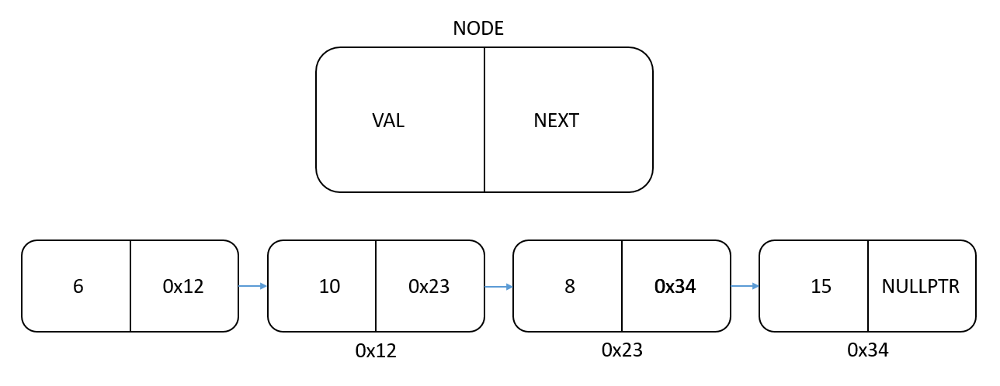

# 02 - Singly Linked Lists

The vector was a beginning to get a more dynamic way to allocate objects rather than the static array which doesn't support delete, insert, and append operations. However, vector still has cons:

* Memory reallocation and data copies when expanding is O(n) even with the capacity trick.
* Acquiring contiguous memory which is not guaranteed to be available every time when reallocating

To solve these issues, we need to figure out how to:

* ensure that expanding the content with a single element is always O(1) with no need to reallocate.
* distribute the content all over the memory to exclude the need to contiguous memory. Pointers can be very helpful here.

Let's say we have the following:

```cpp
int *val1 = new int(6);
int *val2 = new int(10);
int *val3 = new int(8);
int *val4 = new int(15);
```

we have four integers that are allocated in different locations in memory, iterating over these items i.e. I want to go from `val1` to `val2` to `val3` to `val4`.  is impossible without any kind of **linkage** between them.

So we want to link these items so that we have `val1->val2->val3->val4->STOP`. We can do this by creating a structre called `Node` that has 2 variables; the value itself and a pointer to the next value (or the next `Node` ?).

```cpp
struct Node
{
		int data;
		Node* next; // the pointer (address) to the next node in the sequence
		Node(int data) : data(data) {}
};
```

Then we can do something like this,

```cpp
// create the nodes
Node* node1 = new Node(6);
Node* node2 = new Node(10);
Node* node3 = new Node(8);
Node* node4 = new Node(15);

// link the nodes
node1->next = node2;   // 2 is the next of 1
node2->next = node3;   // 3 is the next of 2
node3->next = node4;   // 4 is the next of 3
node4->next = nullptr; // nothing (nullptr) is the next of 4
```

visually, we will have something like this



Now we can iterate on the nodes given just the first node, after processing each node go to its next, if is not `nullptr`, redo the same process. If it is `nullptr`, then the previous node was the end of the list of nodes.

```cpp

struct Node
{
	int data;
	Node* next;
	Node(int data) : data(data) {}
};


// Print the data alongside the address of the node, go to the next node.
// If it's nullptr, we return
void print_nodes(Node* head)
{
	while (head)
	{
		std::cout << << head << ": " << head->data << std::endl;
		// assign `head` to be the next node of `head`
		// so we can sequentially process the remainder of the sequence
		head = head->next;
	}
}

int main()
{
	// create the nodes
	Node* node1 = new Node(6);
	Node* node2 = new Node(10);
	Node* node3 = new Node(8);
	Node* node4 = new Node(15);

	// link the nodes
	node1->next = node2;   // 2 is the next of 1
	node2->next = node3;   // 3 is the next of 2
	node3->next = node4;   // 4 is the next of 3
	node4->next = nullptr; // nothing (nullptr) is the next of 4

	print_nodes(node1);
}
```

Results in
```
00AD0328: 6
00AD0788: 10
00AD06E0: 8
00AD07F8: 15
```

**NOTE:** the addresses will mostly be different each time you run your code. Don't expect identical results with the above.


Now if we had these data in a vector whose capacity if 4 and wanted to add a new data, you will need to reallocatoe a new array, copy all old data to its new loaction, and add the new data in O(n). While with the nodes, you can simply create a node with this data, and assign the address of this node as the next of the previously last node of the list in O(1). The sequence of the nodes is called **linked list**.

We can also write the above function in a for loop like this,

```cpp
void process_nodes_for_loop(Node* head)
{
	for (; head != nullptr; head = head->next)
		std::cout << head << ": " << head->data << std::endl;
}
```


We can also write `print_nodes` to work in a recursive manner like this,

```cpp
void print_nodes_rec(Node* head)
{
	if (head == nullptr)
		return;
	std::cout << head << ": " << head->data << std::endl;
	print_nodes_rec(head->next);
}
```

and it produces the same outcome.

Similarly, if we want to print the data in reverse order, we can do it recursively like this,

```cpp
void print_nodes_rev(Node* head)
{
	if (head == nullptr)
		return;
	print_nodes_rev(head->next);
	std::cout << head << ": " << head->data << std::endl;
}
```

the idea is to only process the data (here we just print it) until you are done with the next node. Recursively, this will cause to go the last node, print it, then we return to the call of the second to last node recursive call, print its data, then return to the previous one and so on. This will result in,

```
012711D8: 15
01271050: 8
01271590: 10
012714B0: 6
```

To search for given data inside the linked list in a recursive manner, we can do this,

```cpp
Node* node_search(Node* head, int data)
{
	// if head is the end of the list, we couldn't find the data so return nullptr
	if (head == nullptr)
		return nullptr;
	// if we found the data, return the head of that call
	if (head->data == data)
		return head;
	// if its not the end of list and we couldn't find the data yet,
	// call recursively on the next node
	return node_search(head->next, data);
}
```

and in the main function

```cpp
int main()
{
	// create the nodes
	Node* node1 = new Node(6);
	Node* node2 = new Node(10);
	Node* node3 = new Node(8);
	Node* node4 = new Node(15);

	// link the nodes
	node1->next = node2;   // 2 is the next of 1
	node2->next = node3;   // 3 is the next of 2
	node3->next = node4;   // 4 is the next of 3
	node4->next = nullptr; // nothing (nullptr) is the next of 4

	Node* node_found_1 = node_search(node1, 8);
	Node* node_found_2 = node_search(node1, 12);
	if (node_found_1)
		std::cout << "Found 8 at node " << node_found_1 <<
		" which for sure has the data " << node_found_1->data << std::endl;
	else
		std::cout << "Couldn't found 8\n";
	if (node_found_2)
		std::cout << "Found 12 at node " << node_found_2 <<
		" which for sure has the data " << node_found_2->data << std::endl;
	else
		std::cout << "Couldn't found 12\n";
}
```

results in

```
Found 8 at node 00D205D0 which for sure has the data 8
Couldn't found 12
```


---


So, we now know that a sequence of structres of `Nodes` linked together is called linked list. More specifically, it's called **singly-** linked list because in the structure of the `Node`, we only have one pointer pointing to the next `Node` in the list.

In linked list, we can expand the list in O(1) by creating the node and just link it, i.e. assign the `next` of the previous node to point to the new node. By convention, The first node of the linked list is **head** and the last node is called **tail**.

We can implement a class for singly linked list as follows,

```cpp
// linked_list.h

struct Node
{
	int data {};
	Node* next {};
	Node(int data) : data(data) {}
};

struct LinkedList
{
private:
	Node* head {}; // pointer to the first node. initialized to nullptr (0)
	Node* tail {}; // pointer to the end node. initialized to nullptr (0)
public:
	void print();
	void insert_end(int data);
};
```

For example in the `main`, we want to do something like this,

```cpp
// main.cpp

LinkedList list;
list.insert_end(6);
list.insert_end(10);
list.insert_end(8);
list.insert_end(15);
list.print();
```

For the `print` function similarly to befor,

```cpp
// linked_list.cpp

void LinkedList::print()
{
	// take a copy of head to avoid changing head of the `LinkedList` object instance
	Node* temp_head = head;
	while (temp_head != nullptr)
	{
		std::cout << temp_head->data << " ";
		temp_head = temp_head->next;
	}
	std::cout << std::endl;
}
```

For the `insert_end`, we want to create a new `Node` with the provided `data` and put it at the end of the list. This can be done by assigning the `next` of the last node `tail` to be that node. So, we can do something like this

```cpp
// linked_list.cpp

void LinkedList::insert_end(int data)
{
	Node* node = new Node(data);
	tail->next = node;
}
```

Now we can run `main.cpp`. And.... 

```
Exception thrown: write access violation.
this->tail was nullptr.
```

why does this happen ? Well, because `tail` for an initialized linked list is nullptr. When we insert a node for the first time, `tail` is empty and also `head` by the way. So, we need to check the case of if the list is still empty, this can be done by checking if `head` and `tail` are `nullptr` or not (if `head` is nullptr then logically `tail` is also nullptr).

```cpp
void LinkedList::insert_end(int data)
{
	Node* node = new Node(data);
	if (head == nullptr)
	{
		// the list is empty
		head = node;
		tail = node;
	}
	else
	{
		// the list isn't empty
		// assign the node as the next of the last node
		tail->next = node; // now tail isn't nullptr, we can access it
	}
}
```

running `main.cpp` again, And... it works but wait

```
6 15
```

Only the first and last elements ! But why ? Well, when we insert the first node (6), `head` and `tail` both assigned to address of this node. However, when inserting a new node, we say the next node of the `tail` is a new node. But we never said that the new node is the new `tail`. So logically the tail of our linked list points to a new node (which is a wrong behavior anyway) but the tail is still the tail.

When inserting a third node, we say for the tail of the list (which is already the first node still) to point to the third node. What about the second node ? well it's somewhere in the memory and we can't track it because we don't have any pointer pointing to it. `head` is pointing to the first node. `tail` is also pointing to the first node because they are the same address since neither have been updated after both getting assigned to the first node and `tail->next` (which is the same as `head->next`) pointing to the thrid node (the last one added). When a fourth node and the final one in our case is inserted, the same thing happens thus we only have access to the first and fourth (last) node.

To fix this tell the list to update its `tail` to be the last node inserted. The `head` will always remain the first node as long as it's not changed but the `tail` should still be updated with each node inserted.

```cpp
void LinkedList::insert_end(int data)
{
	Node* node = new Node(data);
	if (head == nullptr)
	{
		// the list is empty
		head = node;
		tail = node;
	}
	else
	{
		// the list isn't empty, assign the node as the next of the last node
		tail->next = node;
		// assign tail to be the lastly inserted node so we can add nodes to it 
		tail = node;
	}
}
```

and now we can run it safely, I hope,

```
6 10 8 15
```

[Fabrizio, announce our contract with Google, here we go.](https://i.pinimg.com/originals/0a/f5/fe/0af5fe31d25281fa2db0faaa1885dd7f.jpg)


We can traverse our list which means we can walk through the element of our data structrue. Our `print` function is a traversal function as it iterates over all the nodes. Some of the popular traversal methods for data structures; *`min`, `max`, `sum`, `is_sorted`, `search`, `get_nth`*. We can write them in iterative way (while or for loops) or in recrusive way.

All of travesal methods for our linked list follow the same rule, have a temp copy of `head` called `curr`. If `curr` is not `nullptr`, process it and then assign `curr` to be `curr->next`.

* `void print()`

Using a for loop, we can rewrite the `print` method we arleady implemented before.

```cpp
// linked_list.cpp

void LinkedList::print()
{
	for (Node* curr = head; curr != nullptr; curr = curr->next)
	{
		std::cout << curr->data << " ";
	}
	std::cout << std::endl;
}
```

* `Node*`<span id = "getnth">`get_nth`</span>`(int n)`

**NOTE:** `n` here is 1-based which means for a 4-element list, 1 means the first element and 4 is the last element.

```cpp
Node* LinkedList::get_nth(int n)
{
	int curr_n = 1; // here 1 is the first node.
	for (Node* curr = head; curr != nullptr; curr = curr->next)
	{
		if (curr_n == n)
			return curr;
		curr_n++;
	}
	return nullptr;
}
```

* `int search(int data)`

```cpp
// linked_list.cpp

int LinkedList::search(int data)
{
	int index = 0;
	for (Node* curr = head; curr != nullptr; curr = curr->next)
	{
		if (curr->data == data)
			return index;
		index++;
	}
	return -1; // if data not found in list, return -1
}
```

* `int search_improved(int data)`

Improved search is a technique in which we make shorter travesals for commonly-searched data (nodes). This can be done by shifting the data of the found node with the data of the previous node. So, if we have the following list

```
6 10 8 15
```

and we used `search_improved` to search for 15 (assuming this is the first usage of `seach_improved`)

our list will become

```
6 10 15 8
```

and the returned index will be 2.

```cpp
// linked_list.cpp

int LinkedList::improved_search(int data)
{
	if (head->data == data)
		return 0;
	Node* prev = head;
	Node* curr = head->next;
	int index = 1;
	for (; curr != nullptr; prev = curr, curr = curr->next)
	{
		if (curr->data == data)
		{
			std::swap(curr->data, prev->data);
			return index - 1;
		}
		index++;
	}
	return -1;
}
```

```cpp
// main.cpp

int main()
{
	LinkedList list;
	list.insert_end(6);
	list.insert_end(10);
	list.insert_end(8);
	list.insert_end(15);
	list.print();
	int index = list.improved_search(15);
	list.print();
	std::cout << index << std::endl;
}
```

results in

```
6 10 8 15
6 10 15 8
2
```

---

<h2>Questions:</h2>

1. Write a destructor for the `LinkedList` class.

Since we allocate our nodes in the heap, we need to explicitly delete and free them when the `LinkedList` instance is out of scope. Otherwise, we will have a memory leak.

* Iterative approach

```cpp
~LinkedList()
{
	while(head)
	{
		// take a copy of the next
		Node* next = head->next;
		// delete the current head
		delete head;
		// assign head with the temp next
		head = next;
	}
}
```

* Recursive approach

```cpp
void destruct_node(Node* node)
{
	// Base case: return if no node
	if (node == nullptr)
		return;
	// destruct the next node before destructing this one
	destruct_node(node->next);
	// destruct the current node
	delete node;
}

~LinkedList()
{
	destruct_node(head);
	head = nullptr;
	tail = nullptr;
}
```

2. Write a function to insert a new node from the front

```cpp
// linked_list.h

class LinkedList
{
private:
	Node* head {};
	Node* tail {};
	// We track and modify the length with each insert/remove instructions
	int length {};

public:
	void insert_front(int data);
};
```

```cpp
// linked_list.cpp
void LinkedList::insert_front(int data)
{
	Node* node = new Node(data);
	node->next = head;
	head = node;
	length++;

	if (length == 1) // the list was empty before inserting
		tail = head; // the tail will be the same as head for 1-length list
}
```

or


```cpp
// linked_list.cpp
void LinkedList::insert_front(int data)
{
	Node* node = new Node(data);
	if (head == nullptr) // the list is empty
	{
		head = tail = node;
	}
	else
	{
		node->next = head;
		head = node;
	}

	length++;
}
```

3. Write a function to delete the head node

```cpp
void LinkedList::delete_front()
{
	if (length == 0)
		assert(false);
	Node* node = head;
	head = head->next;
	delete node;
	if (head == nullptr)
		// list is empty, so tail must be nullptr instead of old head.
		tail = nullptr;
}
```

4. Get nth from back

We already implemented `get_nth` from front, we can use it directly

```cpp
Node* LinkedList::get_nth_back(int n)
{
	if (n > length)
		return nullptr;
	return get_nth(length + 1 - n);
}
```

5. Are 2 `LinkedList`s the same ?

2 linked lists are the same if they are of the same size and each node from the first list has the same data value as the data of the corresponding node in the second list.

```cpp
bool LinkedList::is_same(const LinkedList& other)
{
	if (length != other.length) return false;
	if (length == 0) return true;
	for (Node* curr = head, *other_curr = other.head; curr != nullptr;
			curr = curr->next, other_curr = other_curr->next)
	{
		if (curr->data != other_curr->data)
			return false;
	}
	return true;
}
```

6. Write a simple `LinkedList` without `tail` or `length` data members. It should contain 3 methods

   * `add_element(int val)` which should have a time complexity of 	**O(1)**. 
   * `print()`
   * `Node* get_tail()`


To have `add_element(int val)` with a complexity of *O(1)*, the data must be in **reversed order**. Previously, the data are inserted from back with O(1) because we track the tail and could access it directly. Now, we only track the head. Either we insert data in the right order with O(n) or insert them reversely in O(1).


We can do it in O(1) by this,

```cpp
// linked_list.h
class MinimalLinkedList
{
private:
	Node* head {};
public:
	void add_element(int val);
};
```

```cpp
// linked_list.cpp

void MinimalLinkedList::add_element(int val)
{
	Node* node = new Node(val);
	node->next = head;
	head = node;
}
```

this way, the data is inserted in O(1) but in reversed order.


For `Node* get_tail()` which should return the last node in the list (first added here), we iterate on all nodes until the next of the current node is `nullptr`, then our current node is the tail of our list

```cpp
Node* MinimalLinkedList::get_tail()
{
	for(Node* curr = head; curr->next != nullptr; curr = curr->next)
	{
		// do nothing
	}
	return curr;
}
```

and `print()` is the same of previously implemented

```cpp
void MinimalLinkedList::print()
{
	for (Node* curr = head; curr != nullptr; curr = curr->next)
		std::cout << curr->data << " ";
	std::cout << std::endl;
}
```

---


Now, we can insert the nodes from front and end in our list, what about deletion of nodes, we have 3 cases:

* Delete the first node (head)
* Delete the last node (tai)
* Delete an intermediate node given its position or its data

1. Delete the first node (head) (already implemented)

```cpp
void LinkedList::delete_first()
{
	if (head == nullptr)
		// report an error because of the trial of removing items from empty list
		assert(false);
	Node* next = head->next;
	delete head;
	head = next;
	length--;
	if (head == nullptr) // or if (length == 0)
	{
		tail = nullptr; // because the list is now empty
	}
}
```

2. Delete the last node (tail)

If there are more than one element in the list,
* get the node previous to the tail
* get a copy of the tail
* assign the next of previous to be `nullptr` instead of tail
* delete the tail and decrement the length

If there is only one element,
* delete that node
* assign head and tail to be `nullptr`
* decrement the length (becomes 0)


```cpp
void LinkedList::delete_last()
{
	if (head == nullptr) // if the list is empty
		return;
	if (head == tail) // if there is only one element
	{
		delete head; // delete that node
		head = tail = nullptr; // assign head and tail to nullptr
		length--;
	}
	else
	{
		Node* prev = head;
		for (; prev->next != tail; prev = prev->next); // get the node previous to tail
		delete tail;
		prev->next = nullptr;
		tail = prev;
	}
	debug_verify_data_integrity();
}
```

we can utilize the `Node*`[get_nth](#getnth)`(int position)` to get the node previous to tail

```cpp
void LinkedList::delete_last()
{
	if (head == nullptr) // if the list is empty
		return;
	if (head == tail) // if there is only one element
	{
		delete head; // delete that node
		head = tail = nullptr; // assign head and tail to nullptr
		length--;
	}
	else
	{
		Node* prev = get_nth(length - 1); // get the node previous to tail
		delete tail;
		prev->next = nullptr;
		tail = prev;
		length--;
	}
}
```


* Delete an intermediate node given its position, `n`
This is the general case and can be divided into 3 cases:
	* `n == 1`: use `delete_first()`
	* `n == length`: use `delete_last()`
	* otherwise, get the node `previous` to the one to be delete using `get_nth` and
    	* get a copy `curr` of the next to `previous` which will be the node to be delete
		* assign the next of `previous` to be the next of next of `previous`
    	* delete `curr` and decrement the length

```cpp
void LinkedList::delete_nth(int n)
{
	if (n == 0)
		return;
	else if (n == 1)
		delete_first();
	else if (n == length)
		delete_last();
	else
	{
		Node* prev = get_nth(n - 1);
		Node* curr = prev->next;
		prev->next = curr->next; // or prev->next = prev->next->next
		delete curr;
		length--;
	}
}
```